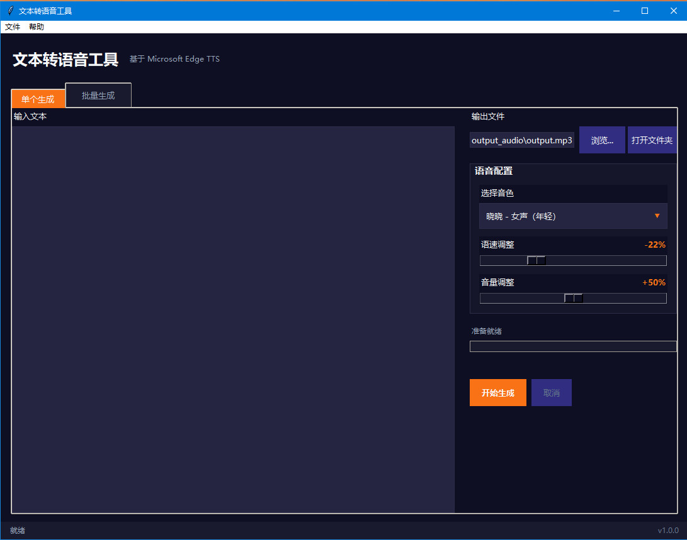
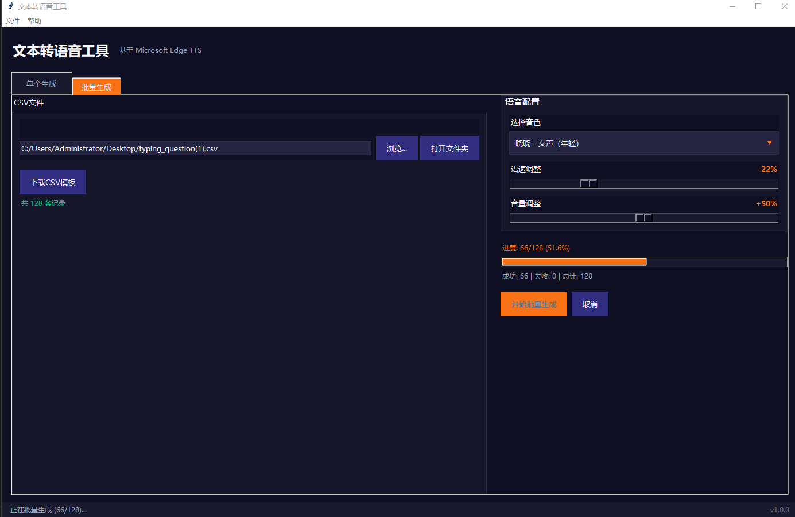

# 文本转语音工具

基于 Microsoft Edge TTS 的文本转语音转换工具，支持单条文本转换和批量CSV文件转换，须联网使用。

## 功能特性

- **单条转换**：输入文本，选择音色，一键生成音频
- **批量转换**：通过CSV文件批量处理，支持并发生成
- **多种音色**：提供4种经过测试的中文音色（晓晓、云希、晓伊、云健）
- **参数调节**：支持语速、音量、音调调整
- **打开文件夹**：生成后可快速打开输出文件夹
- **深色主题**：现代化UI界面

## 效果展示




## 项目结构

```
text-to-voice/
├── gui_main.py              # 程序入口
├── requirements.txt         # 依赖列表
├── setup.py                 # 安装配置
├── 文本转语音工具.spec       # PyInstaller打包配置
├── assets/                  # 资源文件
│   └── template.csv         # CSV模板文件
├── src/                     # 源代码目录
│   ├── config.py            # 配置管理
│   ├── core/                # 核心功能
│   │   ├── tts_generator.py # TTS生成器
│   │   ├── csv_processor.py # CSV处理器
│   │   └── file_manager.py  # 文件管理器
│   ├── gui/                 # GUI界面
│   │   ├── main_window.py   # 主窗口
│   │   ├── single_tab.py    # 单条转换标签页
│   │   ├── batch_tab.py     # 批量转换标签页
│   │   ├── components.py    # 可复用组件
│   │   └── styles.py        # 样式定义
│   └── utils/               # 工具模块
│       ├── logger.py        # 日志工具
│       └── validators.py    # 验证工具
└── dist/                    # 打包输出目录
    └── 文本转语音工具.exe    # 可执行文件
```

## 核心代码介绍

### 1. TTS生成器 (src/core/tts_generator.py)

基于 `edge-tts` 库实现异步文本转语音功能：

```python
class TTSGenerator:
    """文本转语音生成器 - 基于edge-tts"""
    
    def __init__(self, voice: str = "zh-CN-XiaoxiaoNeural", 
                 rate: str = "+0%", 
                 volume: str = "+0%",
                 pitch: str = "default"):
        self.voice = voice
        self.rate = rate
        self.volume = volume
        self.pitch = pitch
```

**核心方法**：
- `generate_audio_async()`: 异步生成单个音频文件
- `generate_batch()`: 批量生成音频，支持并发控制
- `cancel()`: 取消正在进行的任务

**音色配置**：
```python
AVAILABLE_VOICES = [
    ('zh-CN-XiaoxiaoNeural', '晓晓 - 女声（年轻）'),
    ('zh-CN-YunxiNeural', '云希 - 男声（年轻）'),
    ('zh-CN-XiaoyiNeural', '晓伊 - 女声（儿童）'),
    ('zh-CN-YunjianNeural', '云健 - 男声（新闻）'),
]
```

### 2. CSV处理器 (src/core/csv_processor.py)

处理CSV文件的读取和转换结果记录：

```python
class CSVProcessor:
    """CSV处理器 - 读取CSV和记录结果"""
    
    def read(self, max_records: Optional[int] = None) -> List[Dict[str, str]]:
        """读取CSV文件，返回包含answer_text和file_path的字典列表"""
        
    def add_record(self, index: int, text_preview: str, 
                   file_path: str, status: str, message: str = ""):
        """添加转换记录"""
        
    def save_result(self, output_path: Optional[str] = None) -> str:
        """保存转换结果到Markdown文件"""
```

**CSV文件格式要求**：
- 必须包含 `answer_text` 列（要转换的文本）
- 必须包含 `file_path` 列（输出文件路径）
- 支持UTF-8编码

### 3. GUI主窗口 (src/gui/main_window.py)

使用Tkinter构建的现代化界面：

```python
class MainWindow:
    """主窗口类"""
    
    def __init__(self):
        self.root = tk.Tk()
        self.root.title("文本转语音工具")
        self.root.geometry("900x650")
        self.root.minsize(800, 550)
```

**界面组件**：
- 单条转换标签页 (SingleTab)：文本输入、音色选择、参数调节
- 批量转换标签页 (BatchTab)：CSV文件选择、批量处理、进度显示
- 自定义组件 (components.py)：VoiceSelector（美化的音色选择器）、FileSelector（文件选择器）

### 4. 配置管理 (src/config.py)

使用dataclass管理应用配置：

```python
@dataclass
class TTSConfig:
    """TTS配置类"""
    voice: str = 'zh-CN-XiaoxiaoNeural'
    rate: str = '-22%'
    volume: str = '+50%'
    pitch: str = 'default'
    concurrent: int = 5

class ConfigManager:
    """配置管理器 - 支持从JSON文件加载和保存"""
```

### 5. 样式定义 (src/gui/styles.py)

统一的UI样式管理：

```python
# 颜色配置（深色主题）
COLORS = {
    'bg_primary': '#1a1a2e',      # 主背景色
    'bg_secondary': '#16213e',     # 次背景色
    'bg_input': '#0f3460',         # 输入框背景
    'accent': '#e94560',           # 强调色
    'text_primary': '#eaeaea',     # 主文字色
    'text_secondary': '#a0a0a0',   # 次文字色
    'border': '#2d3561',           # 边框色
}
```

## 实现步骤

### 环境准备

1. **安装Python 3.8+**

2. **安装依赖**：
```bash
pip install -r requirements.txt
```

依赖列表：
- `edge-tts>=6.1.0` - Microsoft Edge TTS库
- `pandas>=2.0.0` - CSV文件处理
- `aiofiles>=23.0.0` - 异步文件操作

### 运行程序

**方式一：直接运行**
```bash
python gui_main.py
```

**方式二：安装后运行**
```bash
pip install -e .
文本转语音工具
```

### 使用流程

#### 单条转换
1. 切换到"单条转换"标签页
2. 在文本输入框中输入要转换的文字
3. 从下拉框选择音色（晓晓、云希、晓伊、云健）
4. 调整语速、音量、音调参数（可选）
5. 选择输出文件路径
6. 点击"开始转换"按钮
7. 转换完成后点击"打开文件夹"查看结果

#### 批量转换
1. 切换到"批量转换"标签页
2. 点击"下载CSV模板"获取标准格式模板
3. 编辑CSV文件，填写 `answer_text`（文本内容）和 `file_path`（输出路径）
4. 选择CSV文件
5. 设置并发数（建议3-5）
6. 点击"开始批量转换"
7. 查看转换结果和统计信息

## 打包步骤

### 一键打包（推荐）

项目已内置一键打包脚本，只需执行一行命令：

```bash
python build.py
```

脚本会自动完成以下操作：
1. 终止正在运行的程序实例
2. 清理旧的构建文件和缓存
3. 检查并安装所需依赖
4. 执行 PyInstaller 打包
5. 复制资源文件到输出目录

**输出位置**：`dist/文本转语音工具.exe`

### 手动打包

如果需要手动控制打包过程：

1. **安装PyInstaller**：
```bash
pip install pyinstaller
```

2. **执行打包命令**：
```bash
pyinstaller 文本转语音工具.spec
```

3. **打包配置说明** (`文本转语音工具.spec`)：
```python
a = Analysis(
    ['gui_main.py'],                    # 入口文件
    pathex=[],
    binaries=[],
    datas=[
        ('src', 'src'),                 # 包含src目录
        ('assets', 'assets'),           # 包含assets目录
        ('config', 'config')            # 包含config目录
    ],
    hiddenimports=['pandas', 'edge_tts', 'aiofiles'],
    ...
)
```

### 打包注意事项

1. **文件占用问题**：打包前确保没有程序正在运行 `文本转语音工具.exe`
2. **杀毒软件**：打包后的exe可能被误报，添加信任即可
3. **依赖缺失**：如果遇到模块缺失，在spec文件的 `hiddenimports` 中添加
4. **路径问题**：使用 `sys._MEIPASS` 处理打包后的资源路径

## 常见问题

### 1. 音色无法使用

**原因**：某些地区可能无法访问所有音色
**解决**：程序会自动切换到备用音色，或手动选择其他音色

### 2. CSV文件中文乱码

**原因**：Excel默认使用GBK编码打开UTF-8文件
**解决**：使用记事本或VSCode打开，或在Excel导入时选择UTF-8编码

### 3. 打开文件夹失败

**原因**：输出路径不存在或权限不足
**解决**：程序会自动创建目录，确保有写入权限

### 4. 转换速度慢

**原因**：网络连接或并发设置过低
**解决**：调整并发数（建议3-5），检查网络连接

## 开发扩展

### 添加新音色

在 `src/config.py` 中添加：

```python
AVAILABLE_VOICES: List[Tuple[str, str]] = [
    ('zh-CN-XiaoxiaoNeural', '晓晓 - 女声（年轻）'),
    ('zh-CN-YunxiNeural', '云希 - 男声（年轻）'),
    # 添加新音色
    ('zh-CN-NewVoiceNeural', '新音色 - 描述'),
]
```

### 修改默认参数

在 `src/config.py` 中修改：

```python
@dataclass
class TTSConfig:
    voice: str = 'zh-CN-XiaoxiaoNeural'
    rate: str = '-22%'        # 修改默认语速
    volume: str = '+50%'      # 修改默认音量
    pitch: str = 'default'    # 修改默认音调
    concurrent: int = 5       # 修改默认并发数
```

### 自定义样式

在 `src/gui/styles.py` 中修改：

```python
COLORS = {
    'bg_primary': '#1a1a2e',    # 修改主背景色
    'accent': '#e94560',         # 修改强调色
    # ...
}
```

## 许可证

MIT License

## 致谢

- [edge-tts](https://github.com/rany2/edge-tts) - Microsoft Edge TTS的Python接口
